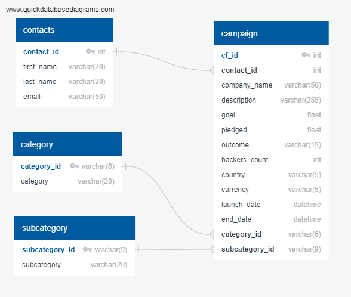
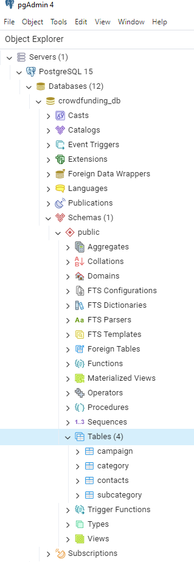
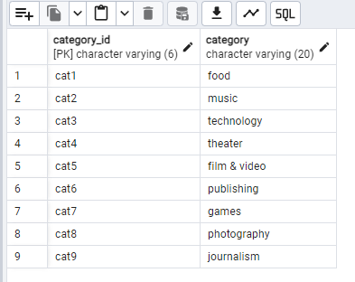
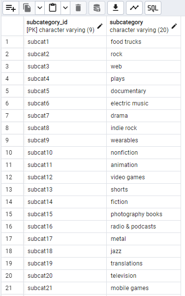
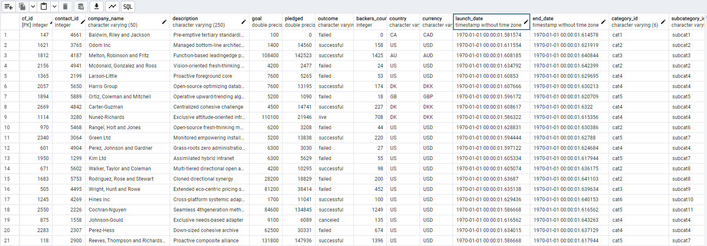
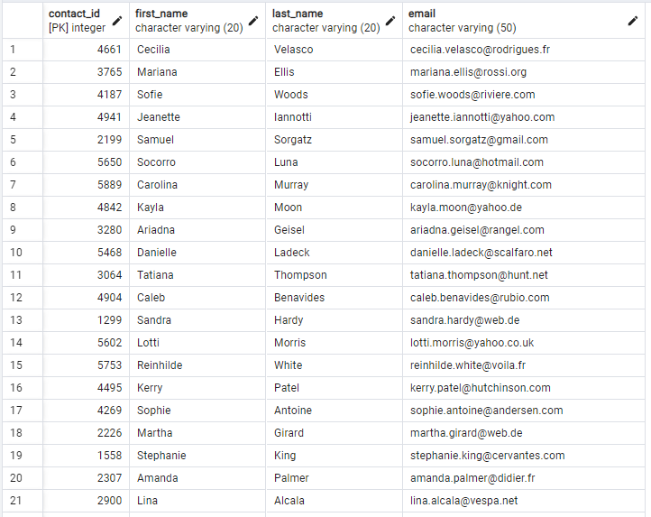

# README for Project 2 ETL (Crowdfunding_ETL)

## Introduction

The focus of this project is building an ETL pipeline using Python, Pandas, JSON, and PostgreSQL. This project extracts data from Excel spreadsheets for a crowdfunding operation. It transforms the data into the third normal form of data normalization (3NF) to increase efficiency and reduce redundancy. Finally it loads the data into a PostgreSQL database.

## Data

The data initially consists of two Excel files ('contacts.xlsx', 'crowdfunding.xlsx'). 

The data from these files is extracted into four CSV files ('campaign.csv', 'category.csv', 'subcategory.csv', 'contacts.csv'). These CSV are located in the Resources directory of the GitHub repository. 

There is also a SQL table schema file ('crowdfunding_db_schema.sql') that was created to import the CSV files into a PostgreSQL database (crowdfunding_db). the SQL file is located in the Resources directory. 

PNG screenshot files of  the ERD and PostgreSQL database are located in the Images directory of the repository.

## Methodology

The ETL work for this project is completed mostly using Pandas. Extracting the data from the Excel spreadsheets, transforming the data in 3NF, and exporting the tables as CSV files are all done using Pandas. The entirety of this Pandas work is located in the IPYNB script file in the repo ('ETL_Mini_Project_NArora_NBartram.ipynb').

QuickDBD ('quickdatabasediagrams.com') was used to create a PNG file of the ERD (Entity-Relationship Diagram).

PostgreSQL was used to create table schemata for the crowdfunding_db database.

## Results

The results show a detailed outline of the crowdfunding operation. First we can see the transformed Pandas DataFrames in the IPYNB file. Those files were exported to CSV files which are located in the CSV_output directory of the repository. 

Once those CSV files were created an ERD was made on QuickDBD:

Here we can the the relationships between the tables. The above PNG file is also located in the Images directory of the repository.

The ERD helped greatly in creating the crowdfunding_db database with PostgreSQL. 

The above is proof that the database was created. What follows are screenshots of the four tables ('campaign', 'category', 'contacts', 'subcategory') using the SELECT * command in SQL:

Above is the category table within crowdfunding_db.

Above is the subcategory table within crowdfunding_db.

Above is the campaign table within crowdfunding_db.

Above is the contacts table within crowdfunding_db.

All of the table PNG files can be located in the Images directory of the repository.

## Conclusion

The Excel files are succesfully extracted to Pandas DataFrames. They are transformed into 3NF (Third Normal Form). They are then mapped using an ERD (Entity-Relationship Diagram) and then imported into a PostgreSQL database (crowdfunding_db).

## References

Class materials were used extensively for this assignment, as well as:

* stackoverflow.com
* Xpert Learning Assistant
* ChatGPT.com

## Usage

CSV files are located in the CSV_output directory.

PNG files are located in the Images directory.

The image\README directory contains links to the README images.

The main IPYNB script file ('ETL_Mini_Project_NArora_NBartram.ipynb') is located in the main directory ('Crowdfunding_ETL').
